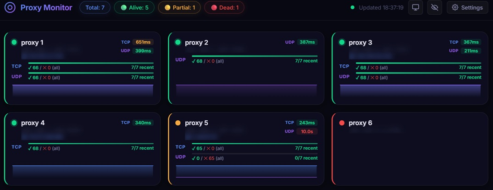

# Proxy Monitor

A Home Assistant add-on for real-time SOCKS5 proxy health monitoring.

## Features

- **TCP & UDP checks** – Full SOCKS5 protocol support
- **Real-time dashboard** – Live status via WebSocket
- **Historical charts** – Success rate and latency over time
- **Web configuration** – Manage proxies from the UI
- **Home Assistant Ingress** – Secure access without extra ports

## Installation

1. Add this repository to Home Assistant Supervisor → Add-on Store.
2. Search for "Proxy Monitor" and install.
3. Click "Open Web UI" to configure.

For configuration, see [DOCS.md](DOCS.md).