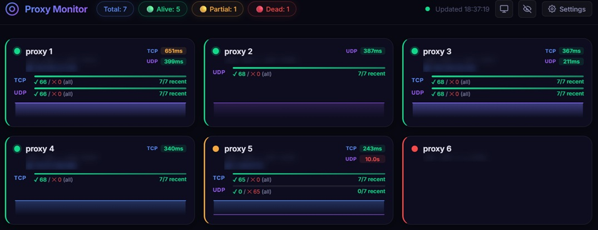

# Proxy Monitor

A Home Assistant add-on for real-time SOCKS5 proxy health monitoring.

## Features

- **TCP & UDP checks** – Full SOCKS5 protocol support
- **Real-time dashboard** – Live status via WebSocket
- **Historical charts** – Success rate and latency over time
- **Web configuration** – Manage proxies from the UI
- **Home Assistant Ingress** – Secure access without extra ports

## Installation

1. Add this repository to Home Assistant Supervisor → Add-on Store.
2. Search for "Proxy Monitor" and install.
3. Click "Open Web UI" to configure.

For configuration, see [DOCS.md](DOCS.md).

## Frontend development

The dashboard source is in `frontend/` (TypeScript, Preact and Vite). The
Python server serves the generated files from `src/web/`. Docker builds those
files in a Node stage before copying them into the add-on image; Node and npm
are not installed in the runtime image.

For local development, run `npm ci` and `npm run dev` in `frontend/` with the
Python server listening on port 8099. Vite proxies `/api` and `/ws` to it.
Run `npm run build` to typecheck and build the static files locally. Generated
`src/web/` files are ignored by Git. The relative asset URLs and API/WebSocket
base paths work under Home Assistant Ingress and at the server root.
